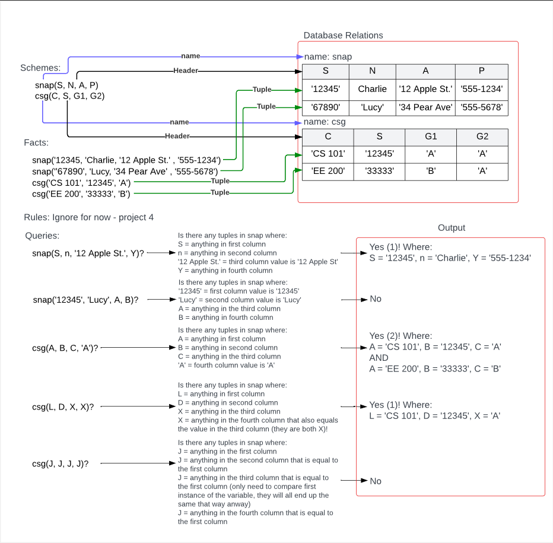

# Datalog Query Interpreter

Project 3 is to write an interpreter that uses relational database operations to evaluate the queries in a Datalog Program. For this project, use only the schemes and facts to evaluate the queries. (The evaluation of rules will be added in the next project.) Here is an example input to the program.

```
Schemes:
  SK(A,B)
Facts:
  SK('a','c').
  SK('b','c').
  SK('b','b').
  SK('b','c').
Rules:

Queries:
  SK(X,'c')?
  SK('b','c')?
  SK(X,X)?
  SK(X,Y)?
  SK('c','c')?
```

Your code must interpret the queries by using relational algebra to create a new relation that is the answer to each query resulting in the following output for the example program.

```
SK(X,'c')? Yes(2)
  X='a'
  X='b'
SK('b','c')? Yes(1)
SK(X,X)? Yes(1)
  X='b'
SK(X,Y)? Yes(3)
  X='a', Y='c'
  X='b', Y='b'
  X='b', Y='c'
SK('c','c')? No
```

Study this example as it expresses all the semantics of query evaluation including pesky corner cases that must be considered. More examples, with annotations to explain each part of the queries in the example, are givin

## The Database Class in the Interpreter

The solution for this project has two main parts:
  1. a simple relational database and
  1. an interpreter that uses the database to evaluate queries.
A relational database is a collection of relations. A relation has a _name_, a _header_, and a _set of tuples_. A header is a list of attribute names. A tuple is a list of attribute values. Relations are used as operands in relational operations such as _select_, _project_, and _rename_.

In this project a Datalog program is represented by a database. Each scheme in the program defines a relation in the database. Each fact in the program defines a tuple in a relation.

Extend the `Interpreter` class in the starter code to include attributes to implement a simple relational database. Your design must should use the already defined `Relation` in the starter code. Additionally, you must implement the functions in the `Relation` class for each of the following relational operations
  - `intersection` (easy)
  - `project` (hard)
  - `rename` (super easy)
  - `reorder` (hard)
  - `select_eq_col` (moderate)
  - `select_eq_lit` (moderate)
  - `union` (easy).
Each of these functions operates on an existing relation and returns a new Relation (the result of the operation).

## Datalog Program Evaluation
Use the relational database to evaluate the Datalog program using these major steps:
1. Evaluate the schemes
1. Evaluate the facts
1. Evaluate the queries
Each of these steps is explained below.

### Evaluating Schemes
Start with an empty Database. For each scheme in the Datalog program, add an empty Relation to the Database. Use the scheme name as the name of the relation and the attribute list from the scheme as the header of the relation.

### Evaluating Facts
For each fact in the Datalog program, add a tuple to a Relation. Use the predicate name from the fact to determine the relation to which the tuple should be added. Use the values listed in the fact to provide the values for the tuple.

### Evaluating Queries
For each query in the Datalog program, use a sequence of select, project, and rename operations on the database to evaluate the query. Evaluate the queries in the order given in the input.
1. Get the Relation from the Database with the same name as the predicate name in the query.
1. Use one or more select operations to select the tuples from the Relation that match the query. Iterate over the parameters of the query:
    - If the parameter is a constant, select the tuples from the Relation that have the same value as the constant in the same position as the constant (i.e., `Relation::select_eq_lit`)
    - If the parameter is a variable and the same variable name appears later in the query, select the tuples from the Relation that have the same value in both positions where the variable name appears (i.e. `Relation.select_eq_col`).
1. After selecting the matching tuples, use the project operation to keep only the columns from the relation that correspond to the positions of the variables in the query. Make sure that each variable name appears only once in the resulting relation. If the same name appears more than once, keep the first column where the name appears and remove any later columns where the same name appears. (This makes a difference when there are other columns in between the ones with the same name.)
1. After projecting, use the rename operation to rename the header of the Relation to the names of the variables found in the query.
The operations must be done in the order described above: all the selects, followed by a project, followed by a rename.

Here is another example for evaluating queries.



The image shows the `Schemes` and `Facts` with the resulting relations. It then show each query in the `Queries` with an explanation of how the the query in computed from the relation with the resulting output of the interpreter. Study the image carefully and do not proceed with coding until it makes sense to you.

### Query Evaluation Output
The project starter code provides the output for you. The following text is a description of that output.

In effect, for each query, the query is output followed by a space. If the relation resulting from evaluating the query is empty, it outputs _'No'_. If the resulting relation is not empty, it outputs _'Yes(n)'_ where $n$ is the number of tuples in the resulting relation. If there are variables in the query, it outputs the tuples from the resulting relation.

The provided code outputs each tuple on a separate line as a comma-space-separated list of pairs. Each pair has the form _N='V'_, where $N$ is the attribute name from the header and $V$ is the value from the tuple. It outputs the name-value pairs in the same order as the variable names appear in the query. It indents the output of each tuple by two spaces.

The tuples are output in sorted order. The sort is alphabetical based on the values in the tuples. It sorts first by the value in the first position and if needed up to the value in the $n^\mathit{th}$ position.
All output should be sent to standard output, not a file.

## Assumptions
You may assume the following about the Datalog program:
- All schemes, facts, rules, and queries with the same name will have the same number of parameters.
- No two attributes in the same scheme will have the same name.
- No two schemes in the scheme list will have the same name.
- Every relation referenced in a fact, rule, or query will have been defined in the scheme section.

## Implementation Requirements
- You are required to use a relational database approach in solving the problem in this project. You must evaluate queries using select, project, and rename operations.
- The relational operations (select, project, and rename) must be implemented as functions in the Relation class from the starter code.
- Queries must be evaluated using relational operations (select, project, and rename).
- The relational operators must not produce relations with duplicate tuples or duplicate names in the header.

## FAQ

### How does the select operation work?

There are two different select operations.

One version of select, `select_eq_lit`, finds all the tuples that have a constant value in a certain column.

This select function could take two parameters, the column `src` and a value `lit`. The `src` parameter is the column in the based on the header in the relation. That position in a tuple would need to have a value equal to the given value for that tuple to be included in the result.

The other version of select, `select_eq_col`, finds all the tuples that have the same value in two different columns -- it doesn't matter what the value is, as long as both columns have the same value.

This select function takes two parameters that are both attributes in the header that indicate the positions of the two columns in the tuples in the relation. The two positions in a tuple would need to have equal values for that tuple to be included in the result.

The select operation does not change the header of the relation. The header of the relation resulting from the select is the same as the header of the original relation.

### How does the project operation work?

The project operation changes the number and order of columns in a relation. The resulting relation may have either the same number or fewer columns. Project changes the header and all the tuples in the relation.

The parameter to the project function could be a list of the positions of the columns that should be included in the result.

### Why is a reorder operator needed to change the order of the columns?

The reorder function will need to be able to change the order of the columns in a relation to support evaluating rules in the next project. Changing the order of the columns is not needed for evaluating the queries in this project.

### How does the rename operation work?

The rename operation changes the header of the relation. The resulting relation has the same tuples as the original.

### Should rename change one attribute at a time, or replace the entire list of attributes at once?

Replacing the entire list of attributes is easier and avoids issues with name conflicts.

### What should select, project, and rename return?

These functions should create a new relation that holds the header and tuples resulting from the operation. They should return this new relation. They should not modify the original relation.

### What should reorder, union, intersection, and difference return?

### When a query has two variables with different names, do the values given to the variables need to be different?

No. Two variables with different names can be given the same value.

Consider the query from the example Datalog program:

```
SK(X,Y)?
```

One of the answers for this query is: `X='b', Y='b'`
